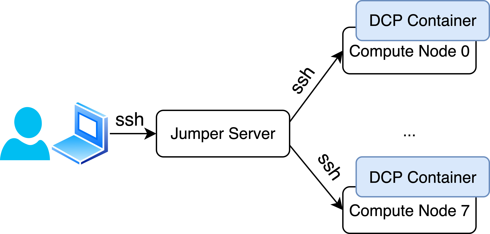

# SOSP'25 Artifact Evaluation

This repository contains DCP's source code as well as automated scripts to run the experiments in the paper.
Since our experiments make extensive use of GPUs, we provide remote access to a test cluster for the evaluation.
Please refer to [this doc](./directory_hierarchy.md) for an overview of the directory hierarchy.

## Overview of evaluation steps
1. Getting Started
    * Read the [getting started](#getting-started) section, get familiar with the provided test environment, launch docker containers, perform sanity checks (30 human-minutes).

2. Microbenchmarks (Sec. 7.1)
    * Perform micro-benchmark on attention operator, produce Fig.12 and Fig.13 (5 human-minutes, **8 compute-hours**)

3. End-to-End Benchmark (Sec. 7.2)
    * Perform end-to-end benchmark with Megatron-LM, produce Fig.14 and Fig.15 (5 human-minutes, **8 compute-hours**)

4. Dry-run (Sec. 7.3)
    * Perform dry-run (only calculate execution plans without actually launching model training), collect data about DCP's algorithms under different parameters. Produce Fig.16 ~ Fig.19 (5 human-minutes, 1 compute-hour)

5. Plot training loss based on E2E benchmark (Sec. 7.4)
    * Analyse the E2E benchmark logs and produce Fig.20 (5 human-minutes)


## Getting Started
The original microbenchmarks were performed using in 4 nodes with 4 A100-40G each, each node possess a 100Gbps NIC.
The original end-to-end evaluation were performed on 8 Amazon EC2 p4d instances, each with 8 A100-40G GPUs, connected
with 4x100Gbps NICs each node.

For artifact evaluation, we provide temporary access to up to 8 Amazon EC2 p4de instances, each with 8 A100-80G GPUs, connected
with 4x100Gbps NICs each node.
The instances are accessible via a jump server (whose IP and credentials will be given via HotCRP).
Each instance (compute node) will host a Docker container, which pre-installed all dependencies needed for the experiments.



The DCP container image is built using the [Dockerfile](../docker/Dockerfile) and tagged `dcp:latest`.
This image should be already available on each compute node.
(To build the image from scratch, run [scripts/docker/build_image.sh](../scripts/docker/build_image.sh)).

To facilitate easy running commands on the compute nodes, the script [scripts/artifact_evaluation/parallell_run.sh](../scripts/artifact_evaluation/parallell_run.sh) can be executed on the jump server, which automatically copies a local shell script into the containers and execute it.
At the same time, it forwards the outputs back to the jump server for easier progress checking.
It takes three arguments: a hostfile containing the address of each compute node (one per line), the script to be executed, and a flag indicating whether the script should be executed inside container or out.
Two hostfiles `hostfile4` and `hostfile8` (for 4-node and 8-node experiments, respectively) will be provided in the same directory (`scripts/artifact_evaluation`).
This script should be the main tool to interact with the cluster.
Since many experiments take a long time to execute, it is recommended to run all following commands inside a tmux session.

### Launch DCP Container

To launch the containers, run (on the jump server):
```bash
cd ~/dcp/scripts/artifact_evaluation
./parallel_run.sh hostfile8 ../docker/start_container.sh 0 # trailing 0 means execute on host
```
The execution result can be viewed from `N*_output.txt` generated in the current directory.

Expected result: The log files contain a single line of container hash (except for the ssh warning).

Note: If the output logs contain `docker: Error response from daemon: Conflict. The container name "/dcp" is already in use by container`. Then it means the previous containers are not properly deleted. Run
`./parallel_run.sh hostfile8 ../docker/remove_container.sh 0` to stop and remove existing DCP containers.
If the resulting log file contains two lines of `dcp`, then the containers have been successfully deleted.

The status of the container can also be checked via
```bash
./parallel_run.sh hostfile8 ../docker/check_container.sh 0
```
which runs `docker ps` on each compute node.

### Sanity check
To make sure DCP and different baselines can execute normally, we first run a single-node test (may take several minutes):
```bash
./parallel_run.sh hostfile8 ./sanity_check.sh
cat N0_output.txt | grep Attn
```
After executing the second command, it is expected to see benchmark results of different frameworks over a simple test case, e.g.,
```
Ring Attn: x.xxxx ms
Zigzag Ring Attn: x.xxxx ms
TE Attn: x.xxxx ms
LoongTrain Attn: x.xxxx ms
DCP Attn: x.xxxx ms
```

## Microbenchmark (Sec. 7.1)
To better match the original experiment, we perform microbenchmarks on 4 p4de nodes.
However, due to the different number of GPUs per node and different network bandwidth, the result is expected to slightly different from original experiments.
To reduce experiment time, we reduce the number of samples for each run from 200 to 50.
This value can be adjusted by the `-ns` argument in `run_microbenchmarks.sh`.

To perform microbenchmarks, run
```bash
./parallel_run.sh hostfile4 ./run_microbenchmarks.sh
```
This command should take around 8 hours to complete. When completed, it will produce microbenchmark results in the `/root/dcp/microbenchmarks` directory of Node 0.

We next plot Fig.12 and Fig.13 on Node 0 and fetch the results back.
```bash
mkdir ~/dcp/reproduced_figures
./run_on_rank.sh 0 hostfile4 ./gen_fig12_13.sh
./fetch_from_rank.sh 0 hostfile4 ~/dcp/reproduced_figures/fig12_13 /root/dcp/reproduced_figures/fig12_13
```
The resulting figures will be stored in `~/dcp/reproduced_figures/fig12_13`, containing the microbenchmark results for both LongAlign and LongDataCollections datasets. Figure `microbenchmark_ldc_msl131072_N4D32_causal_FW.pdf` corresponds to Fig.12(a), `microbenchmark_ldc_msl131072_N4D32_causal_BW.pdf` corresponds to Fig.12(b), and `microbenchmark_ldc_msl131072_N4D32_masks.pdf` corresponds to Fig.13.

## End-to-end benchmark (Sec. 7.2)
To reduce experiment time, we reduce the number of samples for each run from 200 to 100.
This value can be adjusted by the `--n-iters` argument in `run_e2e_benchmarks.sh`.

To perform end-to-end benchmarks, run
```bash
./parallel_run.sh hostfile8 ./run_e2e_benchmarks.sh
```
This command should take around 8 hours to complete. The experiment logs will be stored in `/root/dcp/experiments` of each node. However only the last node (node 7)'s log contains information about iteration time.

We then plot Fig.14 and Fig.15 on Node 7 and fetch the results back.
```bash
./run_on_rank.sh 7 hostfile8 ./gen_fig14_15.sh
./fetch_from_rank.sh 7 hostfile8 ~/dcp/reproduced_figures/fig14_15 /root/dcp/reproduced_figures/fig14_15
```
The resulting figures will be stored in `~/dcp/reproduced_figures/fig14_15`. The filenames indicate each figures' corresponding dataset and max sequence length.

## Dry-run (Sec. 7.3)
Since dry-run do not actually launch model training, it can be performed on a single node.
We split the dry-run of different datasets onto two nodes for faster experiments.
```bash
./run_on_rank.sh 0 hostfile4 ./run_dryrun.sh
# in another terminal or tmux tab
./run_on_rank.sh 1 hostfile4 ./run_dryrun.sh
```
These command should take around 1 hour to complete (if running in parallel).
The dry-run results will be stored in `/root/dcp/dryrun_experiments` in each node.

Since the amount of logs produced is large, we first perform preprocessing on each node, parsing useful information from the raw logs:
```bash
./run_on_rank.sh 0 hostfile4 ./preprocess_dryrun.sh
./run_on_rank.sh 1 hostfile4 ./preprocess_dryrun.sh
```
This produces `dryrun_results_N0.csv` and `dryrun_results_N1.csv` under `/root/dcp/reproduced_figures/dryrun_preprocess` of corresponding nodes. Fetch them back to jump server:
```bash
mkdir -p ~/dcp/reproduced_figures/dryrun_preprocess
./fetch_from_rank.sh 0 hostfile4 ~/dcp/reproduced_figures/dryrun_preprocess/dryrun_results_N0.csv /root/dcp/reproduced_figures/dryrun_preprocess/dryrun_results_N0.csv
./fetch_from_rank.sh 1 hostfile4 ~/dcp/reproduced_figures/dryrun_preprocess/dryrun_results_N1.csv /root/dcp/reproduced_figures/dryrun_preprocess/dryrun_results_N1.csv
```
Finally, plot Fig.16~19:
```bash
cd ~/dcp
python3 benchmark/plotting/plot_dryrun_results.py --csv-files ~/dcp/reproduced_figures/dryrun_preprocess/*.csv --out-dir ~/dcp/reproduced_figures/fig16_19
```

## Precision (Sec. 7.4)
We can directly parse the result of end-to-end experiments on Node 7:
```bash
cd ~/dcp/scripts/artifact_evaluation
./run_on_rank.sh 7 hostfile8 ./gen_fig20.sh
./fetch_from_rank.sh 7 hostfile8 ~/dcp/reproduced_figures/fig20 /root/dcp/reproduced_figures/fig20
```
This generates Fig.20 in ~/dcp/reproduced_figures/fig20. To plot the loss curve for different datasets and max sequence lengths, change the corresponding parameter in `gen_fig20.sh`.

## After Evaluation
Cleanup by deleting `reproduced_figures`:
```bash
rm -rf ~/dcp/reproduced_figures
```

Remove all containers (and delete all obtained results):
```bash
./parallel_run.sh hostfile8 ../docker/remove_container.sh 0
```

## Misc
### Code Update
In case of errors and bugs, update to this repository may be needed. To pull the newest version of DCP within containers, run:
```bash
./parallel_run.sh hostfile8 ./update_dcp.sh
```

### Kill running processes
```bash
./parallel_run.sh hostfile8 ./kill_all.sh
```
